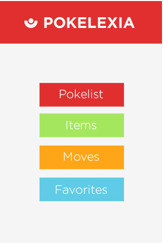
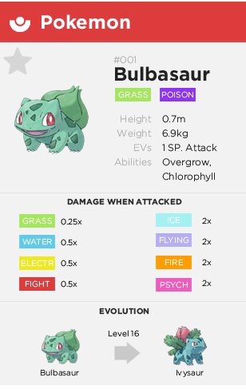
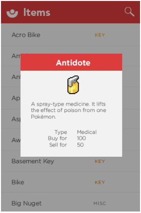
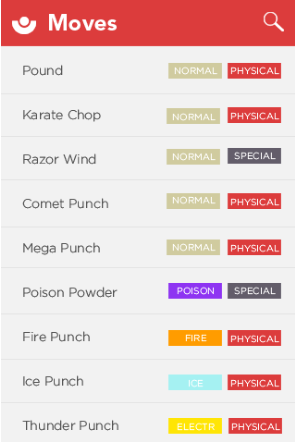

Pokelexia
==============

Pokelexia is a mobile application which contains names, details, and even combat information for each and every Pokemon. The application also features information for moves and items. For all those pokemon fanatics out there, this application may serve as a quick reference for Pokemon information!

Created by
- Alfonz Montelibano
- Davy Jones Bolivar

Screenshots
--------------

